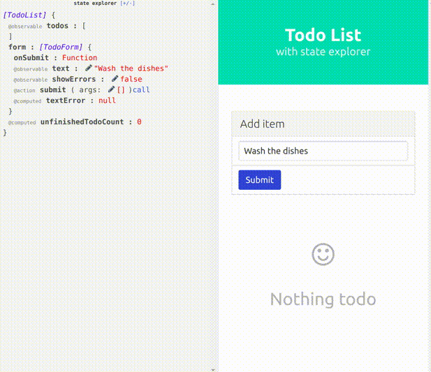

# Interactive mobx state exploration

[](https://skyjur.github.io/mobx-state-explorer/dist/examples/todoList.html)

Usage example:
```js
import explore from 'mobx-state-explorer';

let todoList = new TodoList;

explore(todoList);
```

- Full example code: [examples/todoList/index.ts](examples/todoList/index.ts)
- [Working demo](https://skyjur.github.io/mobx-state-explorer/dist/examples/todoList.html)